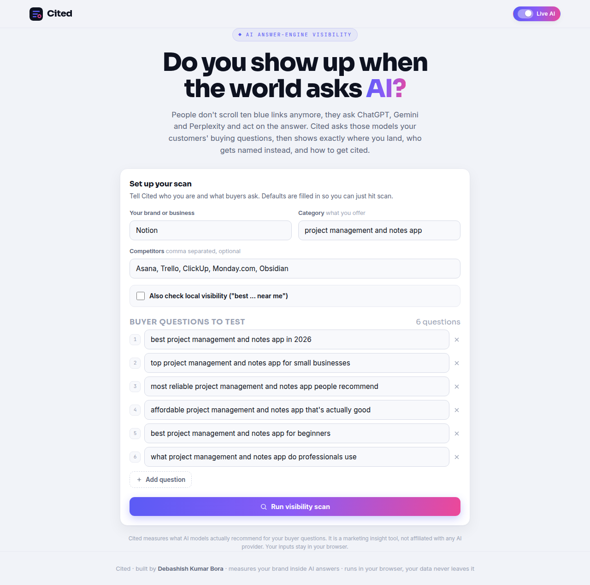
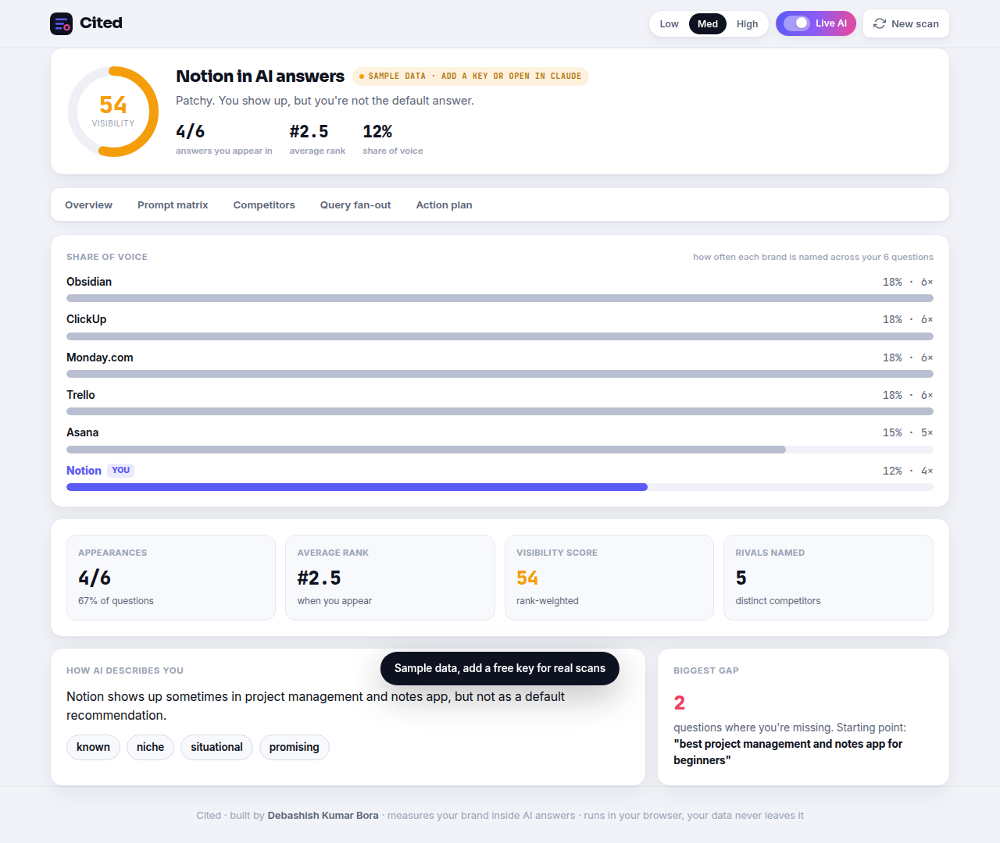
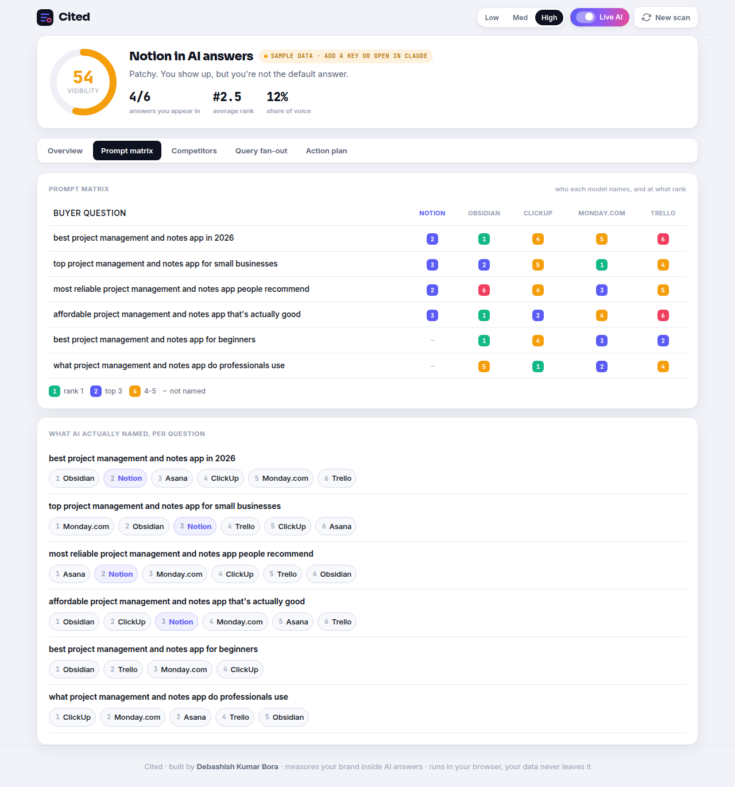
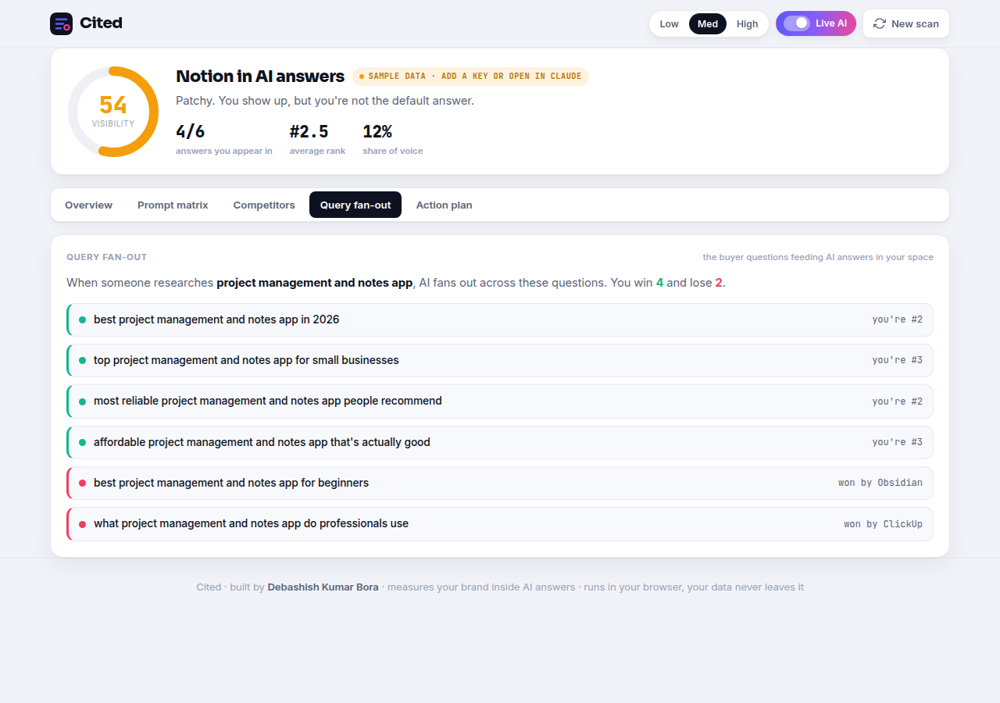

# Cited, do you show up when the world asks AI?

Cited measures your brand's visibility inside AI answers. People increasingly skip the ten blue links and just ask ChatGPT, Gemini, or Perplexity for a recommendation, then act on it. Cited asks those models the buying questions your customers ask, then shows exactly where you land, who gets named instead, and what to do about it. One HTML file. Runs in the browser. Your inputs never leave it.

## Why this, why now

Search is being rebuilt in real time. Zero-click searches jumped from 56% to 69% in a single year after AI Overviews launched, and traditional search volume is projected to fall 25% by 2026 and 50% by 2028. Meanwhile traffic that arrives from an AI answer converts far better than normal search, because the person already trusts the recommendation. A whole discipline (Generative Engine Optimization / Answer Engine Optimization) was born around this, but the existing tools are enterprise-priced at roughly $59 to $499 a month. Freelancers, SMBs, and the agencies serving small clients have nothing. Cited is the sharp, free instrument for exactly them.

## What makes Cited different (and honest)

Most cheap "AI visibility" tools fake it with simulated scores. Cited can measure for real: it sends your buyer questions to an actual model and reads back what it recommends.

- **Live AI mode (real):** inside Claude it works with no key; on your own deployed site, paste a free Google Gemini key. Cited asks the model your questions and detects where your brand actually appears.
- **Sample mode (no key):** if no model is reachable, Cited generates a realistic sample scan from a deterministic engine so the tool is never empty, clearly labelled "Sample data" so nobody is misled.

That is the whole philosophy: the demo is real and useful with zero setup, and the honesty is on the label.

## What you get

- **Visibility score** , a single rank-weighted number for how present you are in AI answers, plus appearances, average rank, and share of voice.
- **Share of voice** , how often each brand is named across all your questions, with you highlighted.
- **Prompt matrix** , the signature view: every buyer question against you and your top rivals, colour-coded by the rank each one lands at.

- **Competitors** , who AI recommends in your category, ranked, and how often they beat you.
- **Query fan-out** , the buyer questions feeding AI answers in your space, shown as wins and losses with who took each one.

- **Action plan** , a prioritized, fully editable set of moves to get cited more often (win the questions you're missing, earn third-party mentions, close the gap with the leader, make your facts machine-readable).
- **Local mode** , flip it on to test "best ... near me" style questions for a location, tagged separately.
- **Low / Medium / High detail** , dial how much depth you want, everywhere.

## Run it

One file. Open `index.html`, or host free on GitHub Pages:

1. Create a public repo named `cited`.
2. Upload `index.html` (plus this `README.md` and the `screenshots/` folder).
3. Settings > Pages > Source: `main` branch, `/root`.
4. Open the URL in an Incognito window (GitHub Pages caches hard).

For real scans on your deployed site, open Cited, turn on Live AI, and paste a free Gemini key from aistudio.google.com/apikey. Without a key the deployed site shows a clearly-labelled sample scan.

## A note on measurement

Cited measures what a model recommends for your questions (its "share of model"). That is one strong, legitimate signal of AI visibility. Enterprise suites also poll live retrieval engines and track citations over time; Cited is the fast, free, single-file take built for individuals and small teams. It is a marketing insight tool and is not affiliated with any AI provider.

## Tech

Single self-contained HTML file. Inline CSS and JavaScript, no frameworks, no build, no backend, no paid services. Hand-built SVG gauge and charts. Sora + Inter + JetBrains Mono. Mobile-first, verified zero horizontal overflow from 360px to 1280px.

---

Built by **Debashish Kumar Bora**
Portfolio: https://debashishkumarbora.github.io
Email: debashishbora30@gmail.com
